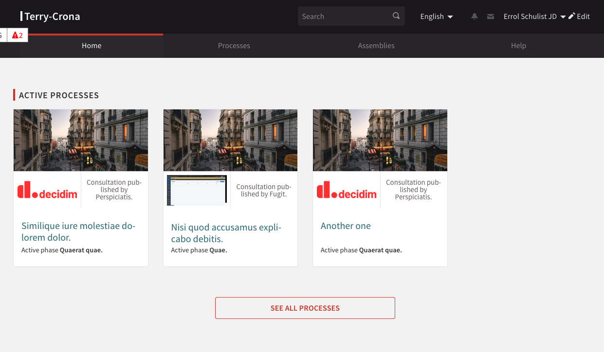

# Decidim::Emitter

Module Decidim Emitter allows to create Emitters (meaning a logo and a name) to link with the current Participatory Processes

## Usage

Emitter will be available as a Component for a Participatory
Space.

## Features

- Create Emitters
- Link Emitters to Participatory Processes
- Display Emitters on Participatory Processes
- Display Emitters on Participatory Processes index
- Display Emitters on Homepage content blocks
- Display Emitters on Participatory Processes cards
- Copy, Update Participatory processes





## Installation

Add this line to your application's Gemfile:

```ruby
gem "decidim-emitter"
```

Or using Github

```ruby
gem "decidim-emitter", github: "OpenSourcePolitics/decidim-emitter"
```

And then execute:

```bash
bundle
```

## Next improvements

- Move emitter to a dedicated model and use a DB relation to link it to Participatory Processes

## Contributing

Contributions are welcome !

We expect the contributions to follow the [Decidim's contribution guide](https://github.com/decidim/decidim/blob/develop/CONTRIBUTING.adoc).

## Security

Security is very important to us. If you have any issue regarding security, please disclose the information responsibly by sending an email to __security [at] opensourcepolitics [dot] eu__ and not by creating a GitHub issue.

## License

This engine is distributed under the GNU AFFERO GENERAL PUBLIC LICENSE.
